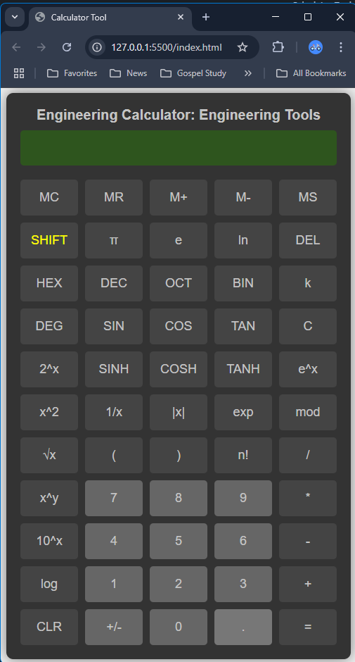

# Engineering Tools

Goals:
 -  [X] Engineering Calculator Tool
 - Diagram Tool
 -  [X] Digital Tool
 - Analog Tool
 - RF & Microwave Tool

Browser based tools
 - IDE: VSCode
 - AI: VSCode GitHub Copilot
 - Languages: HTML, CSS, JavaScript

Usage:
 - Download the tool directory
 - Run npm install
 - Click on the index.html file to run the tool in your browser

<h1>Engineering Calculator Tool</h1>

<h1>Digital Tool</h1>

